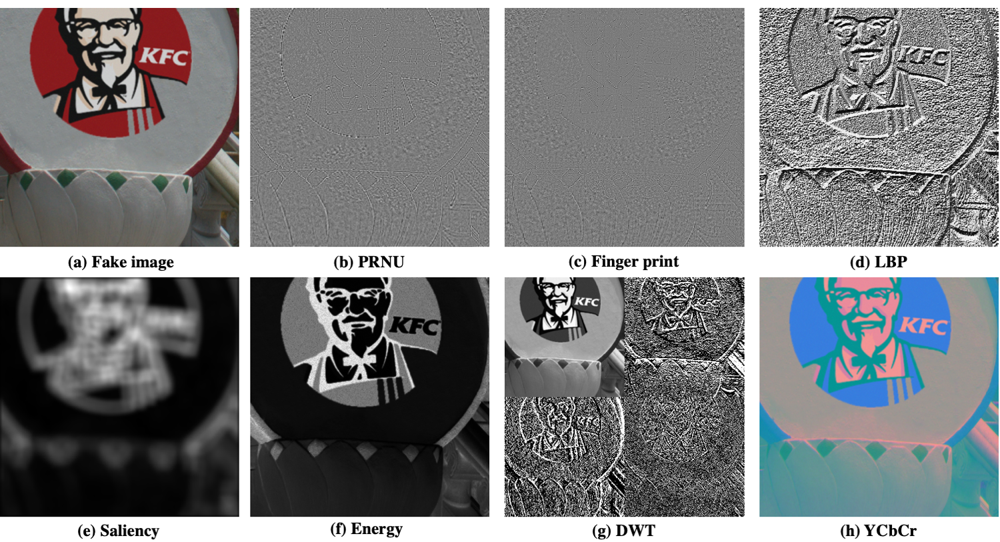

# Image forgery detection by transforming local descriptors into deep-derived features

## Overview
This project is designed for feature extraction from a publicly available dataset and classification using the LIBSVM tool. The code is structured to easily select and extract specific features for further analysis.

## Getting Started

### Prerequisites
Ensure you have MATLAB installed on your system as the provided scripts are in MATLAB format.

### Extracting Features
1. Navigate to the `feature` folder.
2. Open the `main.m` file.
3. You will find seven features commented out. Uncomment the feature you wish to extract. The available features are represented as follows:
   - PRNU
   - Camera Fingerprint
   - LBP
   - Saliency Map
   - Energy 
   - DWT
   - YCbCr

  

4. Run the `main.m` file. Extracted features will be saved in the specified directory.

### Classification
1. Use the files in the `Libsvm` folder for classification.
2. Ensure you configure your paths and parameters as needed before running the classification scripts.

## Citing This Work
If you are using this project in your research or project, please cite it as follows:

```bibtex
@article{anwar2023image,
  title={Image forgery detection by transforming local descriptors into deep-derived features},
  author={Anwar, Muhammad Aqib and Tahir, Syed Fahad and Fahad, Labiba Gillani and Kifayat, Kashif},
  journal={Applied Soft Computing},
  volume={147},
  pages={110730},
  year={2023},
  publisher={Elsevier}
}

